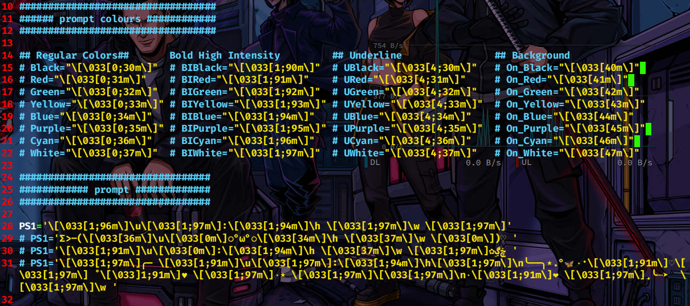
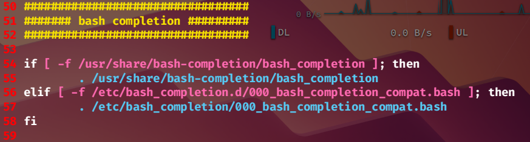
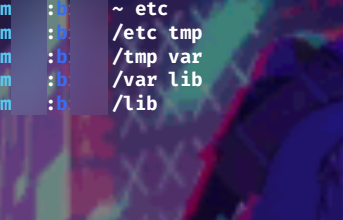
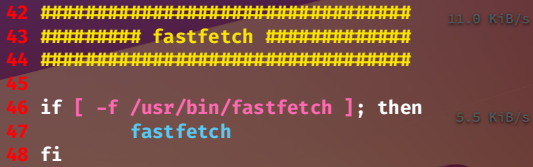
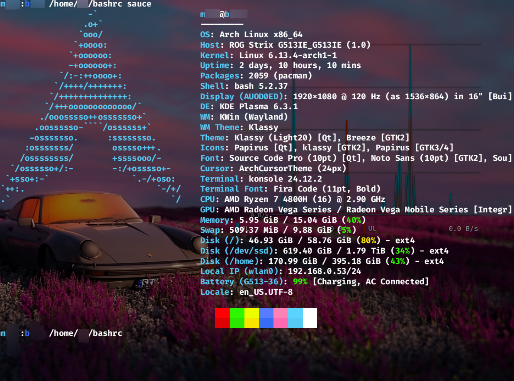
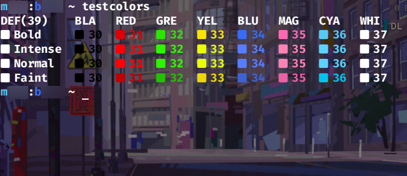
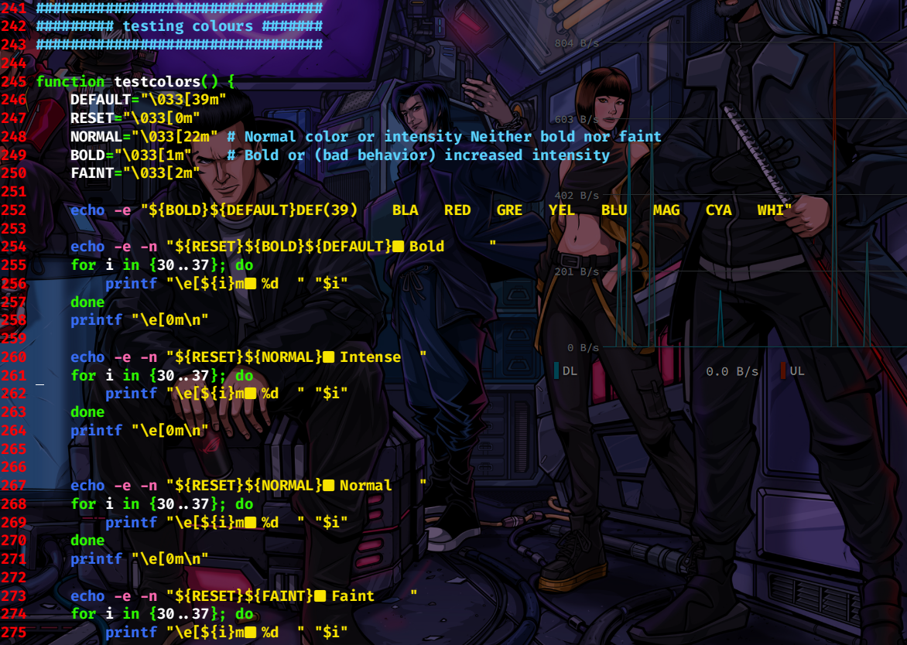
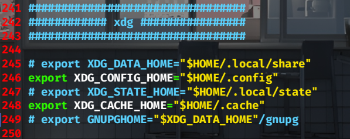

# b a s h r c  for the  l a z y  with 
# ✨ALPHABETICALLY ORDERED ALIASES✨

---

.bashrc **made by a lazy person for lazy people**.

### ▶ [bashrc](bashrc.md)

Now you may be asking yourself, 'why bother with this?, why not just use zsh and save yourself the effort?', well it's simple. Bash is KING.

---

## Includes:

**Aliases that are:**

**Minimal character count**. I try to keep it 1-3 letters.

AND.

**Alphabetically ordered**. I don't know if anyone else does this but putting them in alphabetical order is a game changer. I use nano so just **CTRL + F then #[LETTER]** to easily find or add another alias in a more sane way.

**Prompt colour references**
  - Regular
  - Bold high intensity
  - Underline
  - Background 

I find this usefull so I don't need to search up colour codes every single time I want to change my prompt; I've placed it right above the prompt for easy visual access.

**3 bash prompts**; they can be used as reference for what you can do with it. Prompt #1 is just the vanilla prompt but replaced '@' with ':'.

**Bash completion**

Fingers sore from typing out full commands? Or maybe you're just sad that the bash haters told you bash has no auto completion. Well look no further, bash-completion fixes this. Download it from [archlinux](https://archlinux.org/packages/extra/any/bash-completion/) or [github](https://github.com/scop/bash-completion). Admittedly, I don't even use it but I've still got it in my .bashrc incase i want to turn on the function again one day.

**Dir jumping** 

Ah yes, that thing zsh users like to hold above us; though not AS convenient, this will still do. Just write etc to go to 'etc' instead of 'cd /etc' (same as all other dirs). Yes it's one less character but SO much better lol.

To move back a dir, type '..'.

**Fastfetch**

Get that classic arch btw look and feel with fast fetch. You'll need to install this first from [archlinux](https://archlinux.org/packages/extra/x86_64/fastfetch/) or [github](https://github.com/fastfetch-cli/fastfetch)

**'testcolors' script** so you can check the current terms colour config (useful when using a terminal such as konsole).

To see the below image, type:

        testcolors

Or use the alias

        co

**XDG environments**

This will clean up dot files a little... certainly not a be all end all and will do nothing for those irritating mozilla dots but its still something.

---

## Most used aliases:

These are just a couple of my most used aliases, to view them all, read the [bashrc.md](bashrc.md).

**General:**

- d = cd
- .. = cd ..
- l = ls --color=auto
- ll = ls -lhasr
- r = rm -fr
- sauce = source ~/.bashrc
- n = nano
- nbash = nano ~/.bashrc
- cbash = r ~./bash_history
- s = sudo
- rr = d /
- lb = lsblk

This is a given but some other dir reccomendations to make life easier is to add aliases to other folderes you use often:

- k = d /path/to/dir

To show files you cd at the same time:

- k = d /path/to/dir && l

**Network:**

- nkill = sudo firewall-cmd --panic-on
- non = sudo firewall-cmd --panic-off
- nmkill = sudo systemctl stop NetworkManager.service
- nmon sudo systemctl start NetworkManager.service
- ipa = ip addr

**Pacman:**

- S = sudo pacman -S
- sy = sudo pacman -Sy
- syu = sudo pacman -Syu
- suy = sudo pacman -Suy
- sc = sudo pacman -Sc
- R = sudo pacman -R
- rd = sudo pacman -Rd
- rdd = sudo pacman -Rdd
- qs = sudo pacman -Qs
- kinit = sudo pacman-key --init
- kpop = sudo pacman-key --populate

*You get the point, pretty much this for all pacman cmds*. You may've also noticed both 'syu' and 'suy', this is not a mistake or typo, sometimes you just feel like changing it up yk.

I have also added the same thing for AUR's yay as well;

- ys = yay -S
- ysc = yay -Sc
- yr = yay -R

**Systemctl:**

- stop [UNIT] = sudo systemctl stop [UNIT]
- start [UNIT] = sudo systemctl start [UNIT]
- stat [UNIT] = sudo systemctl status [UNIT]
- enable [UNIT] = sudo systemctl enable [UNIT]
- disable [UNIT] = sudo systemctl disable [UNIT]

**Wireguard:**

- wg = sudo wg

- wgup [WG CONF] = wg-quick up [WG CONF.conf]

- wgdn  [WG CONF] = wg-quick down [WG CONF.conf]

- dwg = d /dir/to/wg.conf  && l

*(I have over 30 wg confs so it's easier to list and cd into; this one is not included in the bashrc.md)*

**These commands will not work if you don't have [wireguard-tools](https://archlinux.org/packages/extra/x86_64/wireguard-tools/) downloaded, for other distros see the [official wireguard](https://www.wireguard.com/install/) site to download the correct one.

**Personal files:**

These are obviously not included here but say you have a certain cfg that you need to see often or you have your nm passwords; other passwords saved in plain text (**HIGHLY UNRECOMENDED** but just for the sake of this example).

Now in this example doing:

    cat /path/to/file/passwd.txt

is obviously idiotic unless you're happy to clear your ~/.bash_history often. A better alternative is to use an editor e.g. nano, vi:

    n = nano

then...

    n /path/to/file/passwd.txt

This alone is still pretty dumb so it's better to make an alias to not only make it easier to access but to also obfuscate the cmd:

    clone = n /path/to/file/passwd.txt

Again, ***not best practice*** to store sensitive information in plain text and this is just an example. 

---

If you are too lazy to read through and copy & paste parts that you actually need then optionally just copy the whole file into ~/. 

***NOTE:*** *It's best practice to ***read*** the .bashrc contents and write in / copy to your own .bashrc as opposed to copying the whole file incase there are conflicts and functions for things you don't have installed.* ***Do not copy and paste random things if you do not know what they do***. 

GNU's [Bash Reference Manual](https://www.gnu.org/software/bash/manual/html_node/index.html#SEC_Contents) is a good reference point; also see [D.1 Index of Shell Builtin Commands](https://www.gnu.org/software/bash/manual/html_node/Builtin-Index.html) to see basic bash command examples. *Again, it is not recommended to do it this way unless you KNOW what you're doing and typing into your terminal.* 

And for the love of god **MAKE A BACKUP OF YOUR .BASHRC**. 

Before continuing with the below steps, review the file so you know the contents; the ➡ [bashrc.md](bashrc.md) ⬅ file is linked at the top next to the arrow. But to save you time from scrolling up and having to move your mouse too far, I've linked it again in this paragraph between the two arrows.

It should also be noted that.. by the way...**I use arch linux.** I am not mentioning this purely so I can let you know that I use arch linux, (this is only partly the reason). I say this because the bashrc file contains a number of aliases related to arch such as pacman, yay or even just systemd which will serve no use and only waste line space if follownig the below steps and you're using a different distro or init. Other distros may also have a different way to write the commands.

#### Creating a backup

        mv ~/.bashrc ~/.bashrc.bak

This will **CHANGE** .bashrc to .bashrc.bak so this should go without saying that you should **NOT** do anything stupid like sourcing bash until the last step. If you want to play it safer:

        cp ~/.bashrc ~/.bashrc.bak

This will ensure you've made a backup and still have a .bashrc file inside your ~/ dir for the time being.

#### Replacing .bashrc 

1. Copy the repository.

        git clone https://github.com/l0vemimi/bashrc

2. Enter dir

        cd bashrc

3. Change file from .md to sh

        mv bashrc.md .bashrc

4. Check permission

        ls -lha

*I set my .bashrc perms as 600, it should not require x perms to work. Check your own .bashrc perms to see what it's set to and set it how you usually have yours.*

        chmod 600 .bashrc

5. Move the file to ~/

**THIS WILL REPLACE YOUR ~/.BASHRC**

        mv .bashrc ~/.bashrc

*You'll be asked if you want to overwrite, press y*

1. Source bash

        source ~/.bashrc

You've now got a more convenient and less chaotic .bashrc. WHOOO 🎊

---
